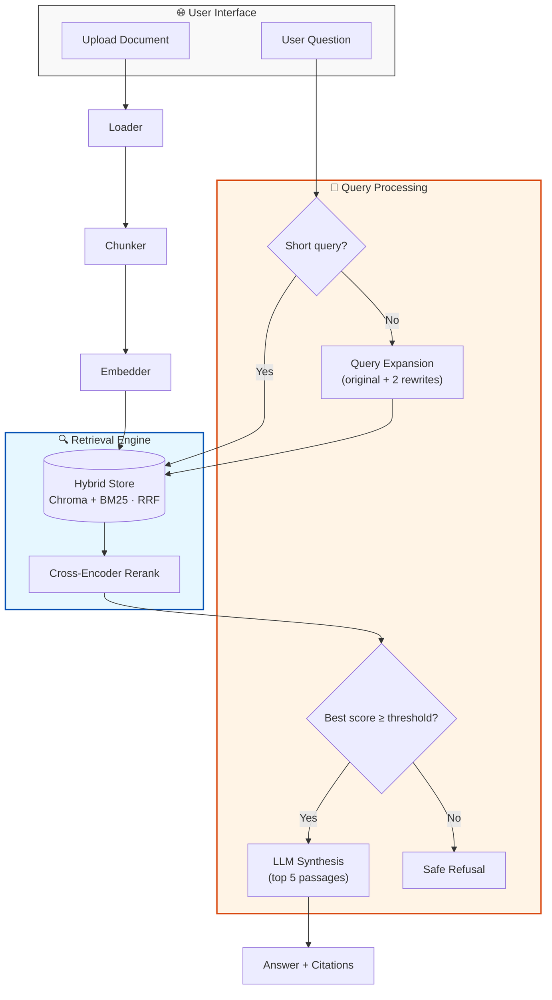

<div align="center">
  
  <h1>Ask My Documents</h1>
  <p><strong>A Privacy-First RAG Platform for Local Document Intelligence</strong></p>

  [](https://github.com/SakthiQ/ask-my-docs/blob/main/LICENSE)
  [](https://www.python.org/)
  [](https://fastapi.tiangolo.com/)
  [](https://ollama.com/)
  []()
</div>

---

## 📌 Table of Contents

- [What is Ask My Documents?](#-what-is-ask-my-documents)
- [Cutting-Edge Features](#-cutting-edge-features)
- [Architecture](#-architecture)
- [Quick Start](#-quick-start-5-minutes)
- [Interactive Demo](#-interactive-demo)
- [Try It Locally](#try-it-locally)
- [API Guide](#-api-guide)
- [Screenshots](#-screenshots)
- [Contributing](#-contributing)
- [How to Update This Project on GitHub](#-how-to-update-this-project-on-github)
- [Roadmap](#-roadmap)

---

## 🎯 What is Ask My Documents?

**Ask My Documents** is an enterprise-grade, privacy-first Retrieval-Augmented Generation (RAG) system. It transforms your local PDFs, DOCX, and Markdown files into an interactive knowledge base—completely offline.

> [!IMPORTANT]
> **100% Local Logic**: No data ever leaves your machine. We use Ollama for LLM inference and Sentence-Transformers for local embeddings.

---

## ✨ Cutting-Edge Features

| Feature | Description | Status |
| :--- | :--- | :---: |
| 🔁 **Query Expansion** | Searches with the original question plus two LLM-generated rewrites to improve recall. | ✅ |
| 🛑 **Safe Refusal** | Declines to answer when no retrieved passage clears the relevance threshold, instead of guessing. | ✅ |
| 🔍 **Hybrid Search** | Combines Semantic Vector (Chroma) + Keyword (BM25) search. | ✅ |
| 🧠 **Cross-Encoder** | State-of-the-art re-ranking for maximum citation accuracy. | ✅ |
| 📑 **Exact Citations** | Precise page, paragraph, and source file tracking. | ✅ |
| ⚡ **Fast Path** | Optimized retrieval for simple factual questions. | ✅ |
| 🖼️ **Multimodal** | Extraction of tables and OCR for image-heavy PDFs. | ✅ |

---

## 🏗️ Architecture



---

## � Quick Start (5 Minutes)

### 1. Prerequisite Checklist
*   [ ] **Python 3.11+** installed.
*   [ ] **Ollama** installed and running.
*   [ ] Run `ollama pull llama3`.

### 2. Setup
```powershell
# Clone & Navigate
git clone https://github.com/SakthiQ/ask-my-docs.git
cd ask-my-docs

# Environment Initialization
python -m venv .venv
.\.venv\Scripts\Activate.ps1
pip install -r requirements.txt
```

### 3. Launch
```powershell
# Start the Backend
uvicorn app.main:app --reload

# Start the Frontend (New!)
streamlit run frontend/streamlit_app.py
```

### 4. Admin uploads (optional)
Uploads default to the `unknown` source tier. To assign a higher tier (`official`, `verified_internal`, `approved_external`) or upload a new version of an existing document, copy `.env.example` to `.env`, set `ADMIN_TOKEN` to a long random value, and enter it in the sidebar's **Admin token** field.

Every upload is scanned for hidden instructions before indexing. Suspicious chunks are quarantined, never indexed, and listed in the Document Library for review.

To add trust metadata to documents ingested before the scan existed, stop the backend and rebuild the index (the old one is kept as a timestamped backup):
```powershell
python scripts/reingest_corpus.py --rebuild --tier official
```

To check that ingestion is complete and the vector index, keyword index and registry agree:
```powershell
python scripts/check_index.py
```
---

---

## Try It Locally (one-line)

If you already have Python and `ollama` installed, run this quick sequence in PowerShell to boot the backend and interactive UI (run in two shells):

```powershell
# Create venv, install deps, start backend and frontend
python -m venv .venv
.\.venv\Scripts\Activate.ps1
pip install -r requirements.txt
uvicorn app.main:app --reload
streamlit run frontend/streamlit_app.py
```

---

## 🧩 Interactive Demo

- **Quick run:** Start the backend and then run the Streamlit UI:

```powershell
# In one shell: start backend
uvicorn app.main:app --reload

# In another shell: start the interactive frontend
streamlit run frontend/streamlit_app.py
```

- **What the demo does:**
  - Upload PDFs/DOCX/TXT from the sidebar to ingest into the local registry.
  - Ask questions in the chat; the app shows answers, citations, and an optional reasoning trace.
  - Manage the indexed document library (view metadata or delete entries).

- **Tips:**
  - Ensure the backend `API_URL` in `frontend/streamlit_app.py` matches your backend host (default `http://127.0.0.1:8000`).
  - For local LLM inference make sure Ollama is running and models are pulled.

## 🚀 Innovations & Next Ideas

Here are small, high-impact ideas to make the project more interactive and innovative. Pick any to prototype next.

- **Real-time Document Stream:** Stream uploads and incremental chunking to show ingestion progress.
- **Explainability Panel:** Visualize re-ranking scores, sentence-level provenance, and why an answer was selected.
- **Model Switcher:** Allow switching LLMs (local Ollama models) from the UI for A/B testing.
- **Collaborative Sessions:** Real-time shared chat rooms for teams to jointly query a document set.
- **Browser Extension:** Quick-context selection in the browser that queries the local RAG instance.
- **Plugin Marketplace:** Small connectors to common enterprise sources (Confluence, SharePoint, Google Drive) with privacy-first sync.
- **Interactive Citation Explorer:** Click a source to preview the page and highlighted excerpt inline.

---

## 📚 API Guide

<details>
<summary>📂 <b>View Endpoints & Examples</b></summary>

### Upload Document
`POST /upload`
```bash
curl -X POST "http://127.0.0.1:8000/upload" -F "file=@/path/to/Policy.pdf"
```

### Ask AI
`POST /query`
```json
{
  "question": "What is the annual leave policy?"
}
```

</details>

---

## �️ Technology Stack

*   **Orchestration**: LangChain, FastAPI
*   **Vector Database**: ChromaDB (Atomic Persistence)
*   **Search**: Hybrid (Vector + BM25Okapi)
*   **Re-ranking**: `cross-encoder/ms-marco-MiniLM-L-6-v2`
*   **Embeddings**: HuggingFace `all-MiniLM-L6-v2`
*   **Logging**: Loguru & Tenacity (Retry Logic)

---

## 🖼️ Screenshots

_Preview (placeholders — add screenshots to `assets/` and update paths):_

<details>
<summary>Open screenshots</summary>


</details>

---

## 🤝 Contributing

We welcome contributions. Small, focused PRs are easiest to review. Please follow these guidelines:

- Create a branch from `main` named `feature/your-feature` or `fix/issue-number`.
- Keep PRs small and include a short description of changes and motivation.
- Run tests (if present) and linters before opening a PR.

See `CONTRIBUTING.md` (if added) for more details.

---

## ⚙️ How to Update This Project on GitHub

Use these PowerShell commands from the repository root to create a branch, commit your changes, and open a Pull Request. Replace the branch name and messages as appropriate.

```powershell
# 1) Sync local main
git checkout main
git pull origin main

# 2) Create a feature branch
git checkout -b feature/your-short-name

# 3) Stage and commit
git add README.md frontend/streamlit_app.py
git commit -m "docs(ui): improve README layout and add screenshots placeholder"

# 4) Push and create PR
git push -u origin feature/your-short-name
# Optional: create PR with GitHub CLI
gh pr create --fill --base main --head feature/your-short-name
```

Use `--force-with-lease` only when rewriting history and you understand the consequences.

---

## 📈 Roadmap

- [x] **Phase 1-3**: Basic RAG, FastAPI, and Advanced Retrieval.
- [x] **Phase 4**: Hybrid Search & Cross-Encoder Reranking.
- [x] **Phase 5**: Agentic Research Loops & HyDE Routing (later removed: they added three LLM calls per query without improving answers).
- [x] **Phase 6**: Multimodal Support (Images/Tables in PDFs).
- [x] **Phase 7**: Evaluation Framework (local LLM-as-judge).

---

<div align="center">
  <p>Built with ❤️ for Privacy and Performance.</p>
  <a href="#table-of-contents">Back to Top</a>
</div>

