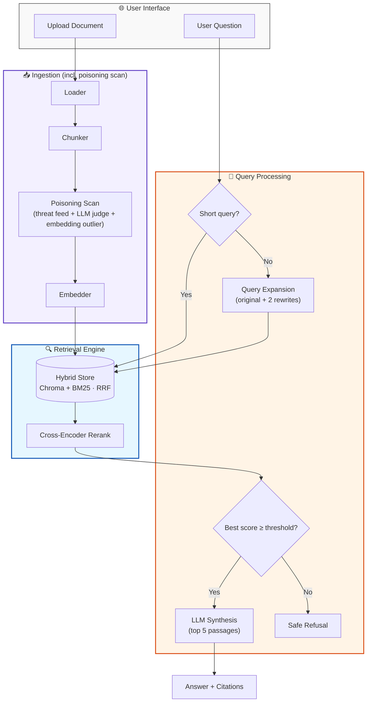
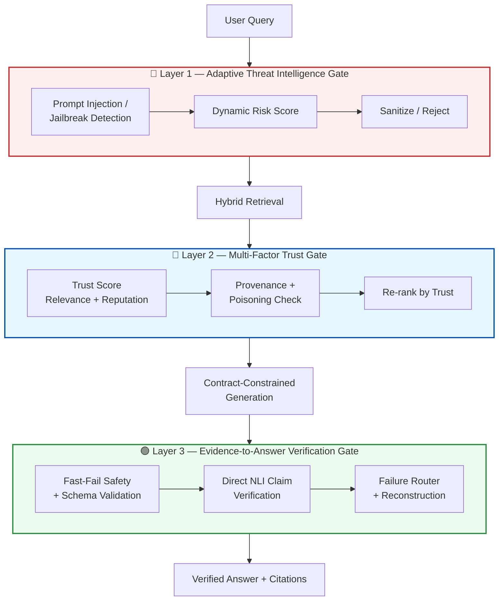

<div align="center">
  <h1>ATTS-RAG</h1>
  <p><strong>Adaptive Threat-Intelligence Trusted &amp; Secure RAG Platform</strong></p>

  [](https://github.com/SakthiQ/ATTS-RAG/blob/main/LICENSE)
  [](https://www.python.org/)
  [](https://fastapi.tiangolo.com/)
  [](https://ollama.com/)
  [](https://streamlit.io/)
  []()
</div>

---

## 📌 Table of Contents

- [What is ATTS-RAG?](#-what-is-atts-rag)
- [Cutting-Edge Features](#-cutting-edge-features)
- [Architecture](#-architecture)
- [🛡️ ATTS-RAG Security Architecture](#️-atts-rag-security-architecture)
- [Quick Start](#-quick-start-5-minutes)
- [Interactive Demo](#-interactive-demo)
- [API Guide](#-api-guide)
- [Technology Stack](#️-technology-stack)
- [Roadmap](#-roadmap)

---

## 🎯 What is ATTS-RAG?

**ATTS-RAG** (Adaptive Threat-intelligence Trusted & Secure RAG) is an enterprise-grade, privacy-first Retrieval-Augmented Generation platform. It wraps local PDF, DOCX, and Markdown document search in a zero-trust defense-in-depth security framework.

> [!IMPORTANT]
> **100% Local Logic**: No data ever leaves your machine. We use Ollama for local LLM inference, Sentence-Transformers for embeddings, and ChromaDB for vector retrieval.

This repository is the complete operational reference implementation for **ATTS-RAG** — wrapping the retrieve-and-generate loop in three active security gates (Query Threat Gate, Trust-Weighted Retrieval Gate, and Evidence-to-Answer Anti-Hallucination Gate) backed by an offline quality improvement flywheel.

---

## ✨ Cutting-Edge Features

| Feature | Description | Status |
| :--- | :--- | :---: |
| 🔴 **Layer 1 — Query Threat Gate** | Screens queries for prompt injections, jailbreaks, PII leaks, and session risk escalation. | ✅ Operational |
| 🔵 **Layer 2 — Multi-Factor Trust Gate** | Discrete decision tree filtering evidence by source tier, anomaly score, content hash, and tenant authorization. | ✅ Operational |
| 🟢 **Layer 3 — Evidence Verification Gate** | Anti-hallucination verification using parallel NLI claim verification ($O(N)$), fast-fail safety checks, and failure routing. | ✅ Operational |
| 🖥️ **Streamlit UI Security Bar** | Real-time 3-layer security indicator (`L1: PASS`, `L2: VERIFIED`, `L3: PASS/REJECT`), evidence citations, and health probe. | ✅ Operational |
| 🔄 **Offline Improvement Flywheel** | Automated sampling of REJECTs and near-threshold claims (`sample_audit_logs.py`), latency benchmarks, and CI gate. | ✅ Operational |
| ⚡ **PyMuPDF Fast Rendering** | High-performance PDF page rendering (`fitz`) with rapid OCR fallback for scanned and image-heavy documents. | ✅ Operational |
| 🕵️ **Ingestion Poisoning Scan** | Screens uploads for hidden prompt injections (threat-feed regex + LLM judge + embedding-outlier check). | ✅ Operational |
| 🔍 **Hybrid Vector + BM25 Search** | Combines Chroma DB vector embeddings with BM25 keyword matching using Reciprocal Rank Fusion (RRF). | ✅ Operational |
| 🧠 **Cross-Encoder Re-ranking** | Micro-re-ranking with `cross-encoder/ms-marco-MiniLM-L-6-v2` for precise passage retrieval. | ✅ Operational |
| 🛑 **Safe Refusal Guarantee** | Refuses to generate unsupported claims when evidence is missing or fails NLI verification. | ✅ Operational |

---

## 🏗️ Architecture

The complete ATTS-RAG pipeline: query processing, hybrid retrieval, ingestion poisoning scan, and three security layers wrapping the retrieve-and-generate loop.



> This diagram shows the core retrieval and ingestion pipeline. The three ATTS-RAG security layers that wrap it are detailed in the next section.

---

## 🛡️ ATTS-RAG Security Architecture

ATTS-RAG wraps the pipeline above in three security layers. All three layers are implemented and tested. The trust metadata (`source_tier`, `anomaly_score`, content hashes) written at ingestion time is actively used at query time for authorization, integrity, and provenance verification.



| Layer | What it does | Status | Documentation & Specs |
| :--- | :--- | :---: | :--- |
| **Knowledge Ingestion** | Rapid PDF rendering (`fitz`) + chunking, local embedding, content-hash registry, hybrid vector/BM25 index. | ✅ Operational | [`loader.py`](app/rag/loader.py), [`chunker.py`](app/rag/chunker.py), [`vectorstore.py`](app/rag/vectorstore.py) |
| **Ingestion Poisoning Scan** | Regex threat feed + LLM judge + embedding-outlier scoring on every uploaded chunk; quarantines rather than indexes suspicious content. | ✅ Operational | [`ingestion_guard.py`](app/rag/ingestion_guard.py), [`injection_patterns.yaml`](config/injection_patterns.yaml) |
| **Layer 1 — Threat Intelligence Gate** | Screens user queries for injection/jailbreak attempts with multi-detector ensemble, dynamic risk scoring, and per-session escalation. | ✅ Operational | [`Layer1_Adaptive_Threat_Intelligence_Gate.md`](docs/Layer1_Adaptive_Threat_Intelligence_Gate.md), [`threat_gate.py`](app/rag/threat_gate.py) |
| **Layer 2 — Multi-Factor Trust Gate** | Discrete decision tree using source tier, anomaly score, content-hash integrity, tenant authorization, and field redaction. | ✅ Operational | [`trust_gate.py`](app/rag/trust_gate.py), [`field_redactor.py`](app/rag/field_redactor.py), [`deletion_propagation.py`](app/rag/deletion_propagation.py) |
| **Layer 3 — Evidence Verification Gate** | Contract-constrained generation, fast-fail safety scanning, parallel NLI claim verification ($O(N)$), failure routing, and reconstruction. | ✅ Operational | [`Layer3_Evidence_To_Answer_Gate.md`](docs/Layer3_Evidence_To_Answer_Gate.md), [`app/rag/layer3/`](app/rag/layer3/) |
| **Offline Improvement Flywheel** | Telemetry audit log sampling (`sample_audit_logs.py`), latency regression benchmarker, and CI workflow integration. | ✅ Operational | [`Offline_Flywheel_Operations.md`](docs/Offline_Flywheel_Operations.md), [`sample_audit_logs.py`](scripts/sample_audit_logs.py) |

> [!NOTE]
> All three ATTS-RAG security layers and the offline flywheel are operational and tested in CI (`pytest tests/`). See [`docs/reports/Frontend_Architecture_Report.md`](docs/reports/Frontend_Architecture_Report.md) for the UI architecture report and [`docs/Offline_Flywheel_Operations.md`](docs/Offline_Flywheel_Operations.md) for flywheel operations.

---

## � Quick Start (5 Minutes)

### 1. Prerequisite Checklist
*   [ ] **Python 3.11+** installed.
*   [ ] **Ollama** installed and running.
*   [ ] Run `ollama pull llama3`.

### 2. Setup
```powershell
# Clone & Navigate
git clone https://github.com/SakthiQ/ATTS-RAG.git
cd ATTS-RAG

# Environment Initialization
python -m venv .venv
.\.venv\Scripts\Activate.ps1
pip install -r requirements.txt
```

### 3. Launch
```powershell
# Start the Backend
uvicorn app.main:app --reload

# Start the Frontend (New!)
streamlit run frontend/streamlit_app.py
```

### 4. Admin uploads (optional)
Uploads default to the `unknown` source tier. To assign a higher tier (`official`, `verified_internal`, `approved_external`) or upload a new version of an existing document, copy `.env.example` to `.env`, set `ADMIN_TOKEN` to a long random value, and enter it in the sidebar's **Admin token** field.

Every upload is scanned for hidden instructions before indexing. Suspicious chunks are quarantined, never indexed, and listed in the Document Library for review.

To add trust metadata to documents ingested before the scan existed, stop the backend and rebuild the index (the old one is kept as a timestamped backup):
```powershell
python scripts/reingest_corpus.py --rebuild --tier official
```

To check that ingestion is complete and the vector index, keyword index and registry agree:
```powershell
python scripts/check_index.py
```
---

---

## Try It Locally (one-line)

If you already have Python and `ollama` installed, run this quick sequence in PowerShell to boot the backend and interactive UI (run in two shells):

```powershell
# Create venv, install deps, start backend and frontend
python -m venv .venv
.\.venv\Scripts\Activate.ps1
pip install -r requirements.txt
uvicorn app.main:app --reload
streamlit run frontend/streamlit_app.py
```

---

## 🧩 Interactive Demo

- **Quick run:** Start the backend and then run the Streamlit UI:

```powershell
# In one shell: start backend
uvicorn app.main:app --reload

# In another shell: start the interactive frontend
streamlit run frontend/streamlit_app.py
```

- **What the demo does:**
  - Upload PDFs/DOCX/TXT from the sidebar to ingest into the local registry.
  - Ask questions in the chat; the app shows answers, citations, and an optional reasoning trace.
  - Manage the indexed document library (view metadata or delete entries).

- **Tips:**
  - Ensure the backend `API_URL` in `frontend/streamlit_app.py` matches your backend host (default `http://127.0.0.1:8000`).
  - For local LLM inference make sure Ollama is running and models are pulled.

## 🚀 Innovations & Next Ideas

Here are small, high-impact ideas to make the project more interactive and innovative. Pick any to prototype next.

- **Real-time Document Stream:** Stream uploads and incremental chunking to show ingestion progress.
- **Explainability Panel:** Visualize re-ranking scores, sentence-level provenance, and why an answer was selected.
- **Model Switcher:** Allow switching LLMs (local Ollama models) from the UI for A/B testing.
- **Collaborative Sessions:** Real-time shared chat rooms for teams to jointly query a document set.
- **Browser Extension:** Quick-context selection in the browser that queries the local RAG instance.
- **Plugin Marketplace:** Small connectors to common enterprise sources (Confluence, SharePoint, Google Drive) with privacy-first sync.
- **Interactive Citation Explorer:** Click a source to preview the page and highlighted excerpt inline.

---

## 📚 API Guide

<details>
<summary>📂 <b>View Endpoints & Curl Examples</b></summary>

### 1. System Health Check
`GET /health`  
Returns real-time health status of FastAPI, Ollama LLM, and ChromaDB vector store.
```bash
curl http://127.0.0.1:8000/health
```

### 2. Ingest / Upload Document
`POST /upload`  
Uploads a document (PDF, DOCX, TXT) for security screening and vector indexing.
```bash
curl -X POST "http://127.0.0.1:8000/upload" -F "file=@/path/to/Policy.pdf"
```

### 3. Query RAG System
`POST /query`  
Submits a user prompt through the 3-layer security pipeline.
```bash
curl -X POST "http://127.0.0.1:8000/query" \
  -H "Content-Type: application/json" \
  -d '{"question": "What is the company MFA policy?"}'
```

### 4. Document Library & Preview
`GET /documents`  
Lists indexed documents.
```bash
curl http://127.0.0.1:8000/documents
```

`GET /documents/{content_hash}/preview`  
Retrieves extracted text preview chunks for a given document.
```bash
curl http://127.0.0.1:8000/documents/a1b2c3d4/preview
```

### 5. Delete Document
`DELETE /documents/{content_hash}`  
Removes a document from vector index, keyword index, and registry.
```bash
curl -X DELETE http://127.0.0.1:8000/documents/a1b2c3d4
```

</details>

---

## �️ Technology Stack

*   **Orchestration**: LangChain, FastAPI
*   **Vector Database**: ChromaDB (Atomic Persistence)
*   **Search**: Hybrid (Vector + BM25Okapi)
*   **Re-ranking**: `cross-encoder/ms-marco-MiniLM-L-6-v2`
*   **Embeddings**: HuggingFace `all-MiniLM-L6-v2`
*   **Logging**: Loguru & Tenacity (Retry Logic)

---

## 🖼️ Screenshots

_Preview (placeholders — add screenshots to `assets/` and update paths):_

<details>
<summary>Open screenshots</summary>


</details>

---

## 🤝 Contributing

We welcome contributions. Small, focused PRs are easiest to review. Please follow these guidelines:

- Create a branch from `main` named `feature/your-feature` or `fix/issue-number`.
- Keep PRs small and include a short description of changes and motivation.
- Run tests (if present) and linters before opening a PR.

See `CONTRIBUTING.md` (if added) for more details.

---

## ⚙️ How to Update This Project on GitHub

Use these PowerShell commands from the repository root to create a branch, commit your changes, and open a Pull Request. Replace the branch name and messages as appropriate.

```powershell
# 1) Sync local main
git checkout main
git pull origin main

# 2) Create a feature branch
git checkout -b feature/your-short-name

# 3) Stage and commit
git add README.md frontend/streamlit_app.py
git commit -m "docs(ui): improve README layout and add screenshots placeholder"

# 4) Push and create PR
git push -u origin feature/your-short-name
# Optional: create PR with GitHub CLI
gh pr create --fill --base main --head feature/your-short-name
```

Use `--force-with-lease` only when rewriting history and you understand the consequences.

---

## 📈 Roadmap

- [x] **Phase 1-3**: Basic RAG, FastAPI, and Advanced Retrieval.
- [x] **Phase 4**: Hybrid Search & Cross-Encoder Reranking.
- [x] **Phase 5**: Agentic Research Loops & HyDE Routing (later removed: they added three LLM calls per query without improving answers).
- [x] **Phase 6**: Multimodal Support (Images/Tables in PDFs).
- [x] **Phase 7**: Evaluation Framework (local LLM-as-judge).
- [x] **Phase 8a**: Ingestion-time poisoning scan (threat feed + LLM judge + embedding outlier detection, quarantine on match).
- [x] **Phase 8b — ATTS-RAG Layer 1**: Query-time threat intelligence gate (injection/jailbreak screening, dynamic risk score, session history).
- [x] **Phase 8c — ATTS-RAG Layer 2**: Trust-weighted re-ranking and provenance verification at query time, using metadata already captured at ingestion.
- [x] **Phase 8d — ATTS-RAG Layer 3**: Evidence-to-answer verification gate (contract-constrained generation, direct NLI claim verification, evidence-gap-aware failure routing, verified answer reconstruction).
- [x] **Phase 8e — Offline Improvement Flywheel**: Telemetry-driven offline process for model, retrieval, and prompt improvements with regression benchmarking and versioned deployment.

See [`implementation_plan.md`](implementation_plan.md) for architectural details and [`docs/Layer3_Evidence_To_Answer_Gate.md`](docs/Layer3_Evidence_To_Answer_Gate.md) for the Layer 3 specification.

---

<div align="center">
  <p>Built with ❤️ for Privacy and Performance.</p>
  <a href="#table-of-contents">Back to Top</a>
</div>

