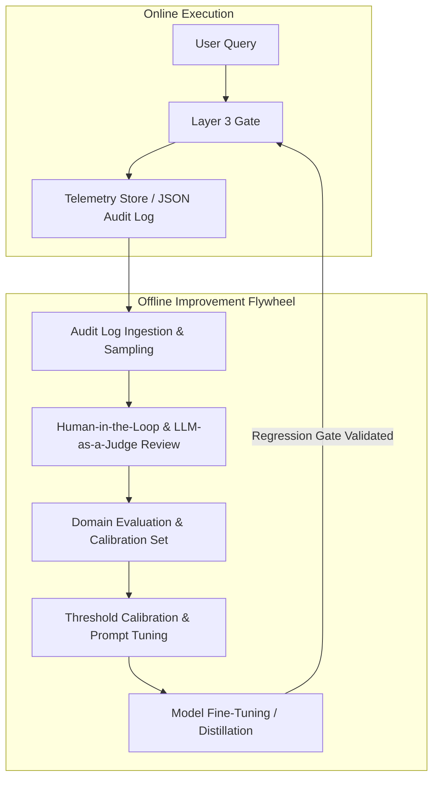

# Layer 3 - Evidence-to-Answer & Output Verification Gate

**System:** ATTS-RAG (Adaptive Threat and Trust Security for Retrieval-Augmented Generation)  
**Boundary:** Output / Answer Release Boundary  
**Status:** Finalized Production Architecture  
**Decision Model:** PASS / REJECT  

---

## 1. Executive Summary

Layer 3 is the final security and correctness boundary in ATTS-RAG. While Layer 2 retrieved and verified knowledge, Layer 3 turns that evidence into an answer and determines whether any generated content can be safely released to the user.

### Primary Security Invariant
> **No factual statement is released unless it exists as a structured claim, references permitted Layer 2 evidence, passes verification, and is rendered from the verified claim set.**

---

## 2. Architecture & Decision Flow

```
[Layer 2 Verified Evidence + User Query]
                   │
                   ▼
       1. Contract-Constrained Generation (`generation.py`)
          Returns JSON: {"claims": [{"claim_id": "C1", "order": 1, "text": "...", "evidence_ids": ["E2"]}]}
                   │
                   ▼
       2. Fast-Fail Safety & Schema Validation (`safety.py`, `schema.py`)
          Deterministic scanning (< 15ms): API keys, PII, prompt leakage, evidence allow-list validation.
                   │
           ┌───────┴───────┐ (Parallel Execution via asyncio.gather)
           ▼               ▼
       3A. Relevance   3B. Direct Claim Verification (`claim_verify.py`)
           Evaluator       Direct lookup by evidence_ids -> Batched NLI (ENTAILMENT / CONTRADICTION)
           (`relevance.py`)
           └───────┬───────┘
                   │
                   ▼
       4. Failure-Type Router (`failure_router.py`)
          - Generation error (contradiction with usable evidence / schema format error) -> 1-shot targeted retry
          - Evidence gap / Secret leak / Policy failure -> Immediate REJECT
                   │
                   ▼
       5. Verified Answer Reconstruction (`reconstruction.py`)
          Assembles final output exclusively from claims that passed verification.
```

---

## 3. Detailed Component Blueprint

### 3.1 Contract-Constrained Generation (`generation.py`)
The generator is strictly instructed to return structured claim objects in JSON format:

```json
{
  "claims": [
    {
      "claim_id": "C1",
      "order": 1,
      "text": "Employees must rotate passwords every 90 days.",
      "evidence_ids": ["chk_101"]
    }
  ]
}
```

No raw free-text response is trusted or processed. All released text is derived strictly from claims.

### 3.2 Fast-Fail Safety & Schema Validation (`safety.py`, `schema.py`)
Runs cheap deterministic checks immediately post-generation:
- **Secrets**: API keys (`sk-`, `AKIA`), RSA keys, JWT tokens.
- **Cross-Tenant**: Rejects data from outside the allowed tenant context.
- **Allow-List**: Validates that all `evidence_ids` belong to the Layer 2 verified evidence allow-list.

### 3.3 Direct Claim Verification (`claim_verify.py`)
Evaluates NLI entailment ($O(N)$ lookup) against the cited `evidence_ids`:
- `ENTAILMENT`: Cited evidence supports the claim. Claim passes.
- `CONTRADICTION`: Cited evidence conflicts with the claim. Triggers router.
- `INSUFFICIENT`: Cited evidence does not establish the claim.

### 3.4 Failure-Type Router (`failure_router.py`)
Classifies failures into retryable vs non-retryable:
- **Generation Error (Retryable once)**: Misstated evidence when usable evidence exists in Layer 2.
- **Evidence Gap (Immediate REJECT)**: Layer 2 evidence package lacks supporting data. Retrying against the same evidence package will not manufacture missing facts.

### 3.5 Verified Answer Reconstruction (`reconstruction.py`)
The final response is composed **exclusively** from claims that passed NLI verification (`compose(C1, C2)`). Any unverified prose or failed claim is excluded from release.

---

## 4. Auditing & Privacy

- Security logs retain `query_id`, `model_version`, `evidence_ids_used`, `verified_claim_count`, `decision`, and `failure_label`.
- Raw prompt and answer text are redacted in persistent security audit trails.

---

## 5. Offline Improvement Flywheel

ATTS-RAG relies on fixed, deterministic thresholding for online runtime evaluation (`ENTAILMENT ≥ 0.70`, `CONTRADICTION ≥ 0.50`). To continuously refine system accuracy and safety without introducing online latency spikes or non-deterministic runtime threshold shifting, ATTS-RAG employs an **Offline Improvement Flywheel**.



### Flywheel Workflow
1. **Telemetry & Audit Log Collection**: All query execution metadata, claim verification scores, retry counts, and rejection reasons are captured by `Layer3TelemetryStore`.
2. **Offline Sampling & Labeling**: Rejections, retries, and high-uncertainty claims (near threshold boundaries) are sampled for offline expert and LLM-as-a-judge annotation.
3. **Threshold Calibration**: NLI confidence thresholds (`ENTAILMENT`, `CONTRADICTION`) are calibrated offline on curated domain evaluation datasets to maximize precision/recall.
4. **Model Tuning & Distillation**: Domain-specific NLI cross-encoders and prompt templates are updated offline.
5. **CI/CD Regression Gating**: Updated models and thresholds are validated through automated unit test suites and latency regression gates (`check_latency_regression.py`) before deployment to production.

